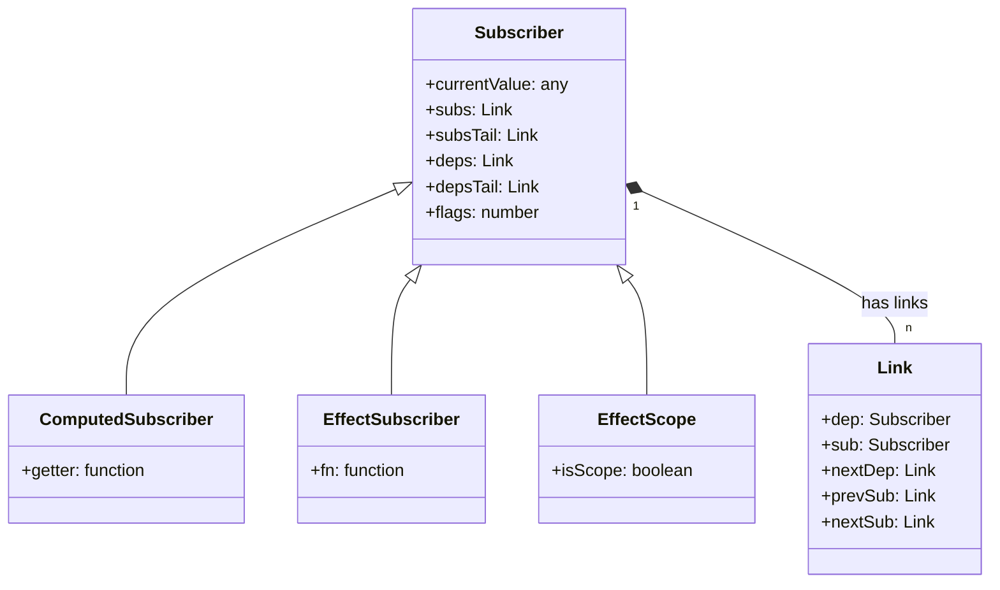
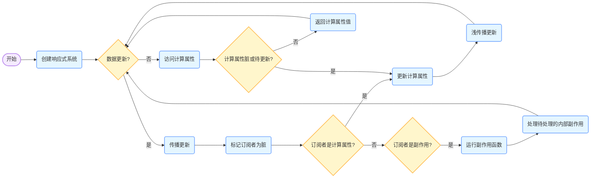
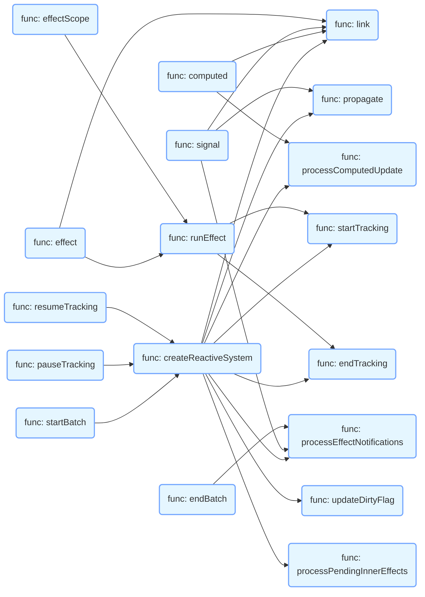

# copy-alien-signals

> 抄录下代码实现

- form [stackblitz/alien-signals](https://github.com/stackblitz/alien-signals)

## UML 解释

- Subscriber（订阅者）：这是一个基类，代表所有可以订阅依赖的对象，包含当前值、依赖链表、订阅者链表和标志位等属性。
- ComputedSubscriber（计算订阅者）：继承自 Subscriber，表示计算属性，有一个 getter 函数用于计算值。
- EffectSubscriber（副作用订阅者）：继承自 Subscriber，表示副作用，有一个 fn 函数，当依赖变化时会执行这个函数。
- EffectScope（副作用作用域）：继承自 Subscriber，用于管理一组副作用，有一个 isScope 标志来标识。
- Link（链接）：用于表示依赖和订阅者之间的链接关系，包含依赖对象、订阅者对象以及前后链接指针。

## 流程图

流程图解释

1. 开始：创建响应式系统。
2. 数据更新检测：判断是否有数据更新

- 如果有数据更新：
  - 传播更新，标记相关订阅者为脏。
  - 判断订阅者类型：
    - 如果是计算属性，更新计算属性的值，并进行浅传播更新。
    - 如果是副作用，运行副作用函数，并处理待处理的内部副作用。
- 如果没有数据更新：

  - 当访问计算属性时，检查计算属性是否脏或待更新。

    - 如果是，更新计算属性的值。
    - 如果否，直接返回计算属性的值。

    3.循环：整个过程会不断循环，以确保系统始终保持响应式。

## 主要函数调用关系

函数调用关系解释：

- createReactiveSystem 函数是核心，它返回多个处理依赖关系和更新的方法。
- computed、signal、effect、effectScope 等函数是对外接口，它们会调用 createReactiveSystem 返回的方法来实现具体功能。
- endBatch、startBatch、pauseTracking、resumeTracking 等函数用于控制批量更新和跟踪状态。
